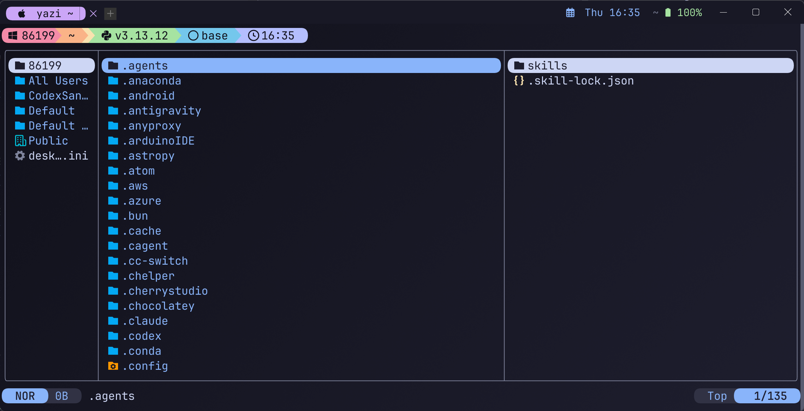
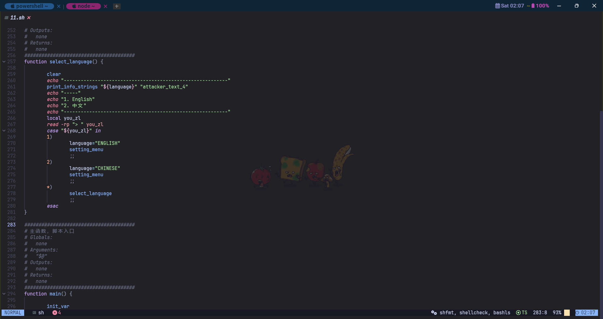
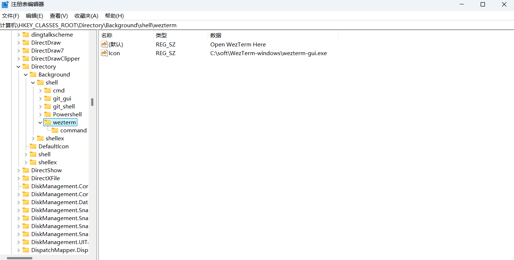
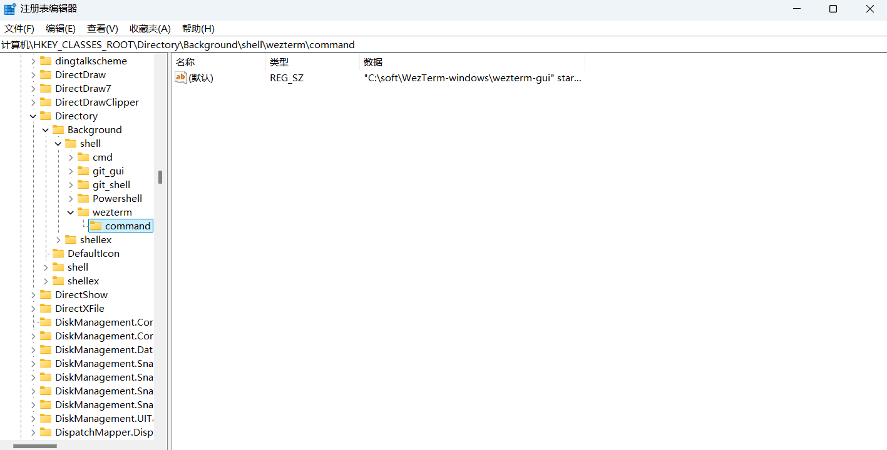

<div align="center" id="madewithlua">
  
</div>

<h1 align="center">WezTerm 配置</h1>

<div align="center">
  <a href="https://github.com/QianSong1/wezterm-config/releases"></a>
  <a href="https://github.com/QianSong1/wezterm-config/stargazers"></a>
  <a href="https://github.com/QianSong1/wezterm-config/issues"></a>
  <br />
  <a href="https://github.com/QianSong1/wezterm-config/blob/main/LICENSE"></a>
  <a href="https://github.com/QianSong1/wezterm-config"></a>
</div>

<p align="center">
  一套模块化的 WezTerm 配置，主要面向 Windows 使用，同时保留 macOS / Linux 分支。
</p>

## 效果预览



<!--  -->

## 配置结构

入口文件是 `wezterm.lua`。它会创建一个 `Config` 对象，然后按模块顺序合并配置：

```lua
return Config:init()
  :append(require("config.appearance"))
  :append(require("config.bindings"))
  :append(require("config.domains"))
  :append(require("config.fonts"))
  :append(require("config.general"))
  :append(require("config.launch")).options
```

主要目录说明：

| 路径 | 用途 |
| --- | --- |
| `wezterm.lua` | WezTerm 主入口，负责加载各配置模块 |
| `config/init.lua` | 简单的配置合并器，避免所有设置堆在一个文件里 |
| `config/appearance.lua` | 主题、背景、标签栏、窗口、光标等外观设置 |
| `config/bindings.lua` | 键盘快捷键、Leader 键、鼠标绑定 |
| `config/domains.lua` | SSH、WSL、Unix domain 配置 |
| `config/fonts.lua` | 字体和字体渲染配置 |
| `config/general.lua` | 自动重载、更新检查、滚动行数、超链接规则等通用设置 |
| `config/launch.lua` | 默认终端、启动菜单、不同平台的 shell 配置 |
| `colors/` | 自定义配色和 Catppuccin Mocha 配色 |
| `events/` | 右侧状态栏、标签标题、新建标签按钮等事件逻辑 |
| `utils/` | 平台判断和通用工具函数 |
| `screenshots/` | README 中使用的截图 |
| `img/` | 文档插图，例如右键菜单注册表截图 |

## 前提条件

1. 安装 WezTerm

   下载地址：<https://github.com/wezterm/wezterm/releases>

   当前文档示例中的安装目录为：

   ```text
   C:\soft\WezTerm-windows
   ```

2. 安装 Nerd Font 字体

   当前配置默认使用：

   ```text
   JetBrainsMono NF
   ```

   也可以安装这些字体：

   - [MesloLGM Nerd Font](https://github.com/ryanoasis/nerd-fonts/blob/v3.2.1/patched-fonts/Meslo/M/Regular/MesloLGMNerdFont-Regular.ttf)
   - [JetBrainsMono Nerd Font](https://github.com/ryanoasis/nerd-fonts/blob/v3.2.1/patched-fonts/JetBrainsMono/Ligatures/Regular/JetBrainsMonoNerdFont-Regular.ttf)

   字体版本建议和图标版本保持一致。若标签、状态栏或菜单图标显示为乱码，通常是 Nerd Font 版本不匹配，可以到 <https://www.nerdfonts.com/cheat-sheet> 搜索并替换对应图标。

3. 可选安装项

   `config/launch.lua` 中的启动菜单包含 PowerShell、PowerShell 7、Cmd、Nushell、Git Bash、SSH 等入口。如果没有安装对应程序，需要删除菜单项或改成自己的路径。

## 安装使用

1. 下载或克隆本仓库。

2. 将仓库内容放到 WezTerm 配置目录：

   ```text
   C:\Users\86199\.config\wezterm
   ```

   如果是其他 Windows 用户，请将 `86199` 改成自己的用户名。WezTerm 默认会读取：

   ```text
   %USERPROFILE%\.config\wezterm\wezterm.lua
   ```

3. 启动或重启 WezTerm。

4. 修改配置后无需手动重启，`config/general.lua` 中已经启用：

   ```lua
   automatically_reload_config = true
   ```

## 常见修改

### 修改默认终端

默认终端在 `config/launch.lua` 中配置。Windows 当前使用 PowerShell 7：

```lua
options.default_prog = { "C:\\Users\\86199\\scoop\\shims\\pwsh.exe" }
```

如果你的 `pwsh.exe` 不在这个位置，请改成自己的实际路径，例如：

```lua
options.default_prog = { "C:\\Program Files\\PowerShell\\7\\pwsh.exe" }
```

### 修改启动菜单

启动菜单同样在 `config/launch.lua` 中维护：

```lua
options.launch_menu = {
  { label = "PowerShell v7", args = { "C:\\Users\\86199\\scoop\\shims\\pwsh.exe" } },
  { label = "Cmd", args = { "cmd" } },
}
```

新增一个工具时，添加一项 `{ label = "...", args = { "..." } }` 即可。若路径里有反斜杠，需要写成双反斜杠 `\\`。

### 修改字体

字体在 `config/fonts.lua` 中配置：

```lua
local font = "JetBrainsMono NF"
local font_size = platform().is_mac and 12 or 12
```

把 `font` 改成已经安装到系统里的字体名即可。

### 修改主题和窗口外观

主题、背景、标签栏、窗口边距、光标样式在 `config/appearance.lua` 中配置。当前主题为：

```lua
color_scheme = "Catppuccin Mocha"
```

如果想调透明度，可以修改：

```lua
window_background_opacity = 1
```

### 修改 WSL / SSH

WSL 和 SSH 配置在 `config/domains.lua`。

WSL 示例：

```lua
{
  name = "WSL:Ubuntu-24.04",
  distribution = "Ubuntu-24.04",
  username = "glance",
  default_cwd = "/home/glance",
  default_prog = { "bash", "--login" },
}
```

SSH 示例：

```lua
{
  name = "Kali-linux",
  remote_address = "192.168.44.147:22",
  username = "kali",
}
```

根据自己的发行版名称、用户名、主机地址和密钥路径修改即可。

### 同步 dotfiles

如果使用 bare Git 仓库同步配置，可以按 `F9` 打开 Dotfiles LazyGit，或者按 `F3` 后选择 `Dotfiles LazyGit`。

这个入口会把 Git 环境设置为：

```text
GIT_DIR=%USERPROFILE%\.dotfiles-git
GIT_WORK_TREE=%USERPROFILE%
```

然后启动 `lazygit`。在 lazygit 里可以用接近图形界面的方式完成查看 diff、stage 文件、commit、pull、push 等操作。

如果还没有安装 lazygit，入口会提示安装命令：

```powershell
scoop install lazygit
```

## 快捷键

Windows / Linux 下，配置里的 `SUPER` 被映射为 `Alt`，`SUPER_REV` 被映射为 `Alt + Ctrl`。Leader 键为 `Ctrl + Shift + Space`。

| 快捷键 | 功能 |
| --- | --- |
| `F1` | 进入复制模式 |
| `F2` | 打开命令面板 |
| `F3` | 打开启动器 |
| `F4` | 打开标签页导航 |
| `F8` | 用记事本打开 `config/domains.lua` |
| `F9` | 打开 Dotfiles LazyGit |
| `F11` | 切换全屏 |
| `F12` | 打开调试面板 |
| `Ctrl + Shift + C` | 复制 |
| `Ctrl + Shift + V` | 粘贴 |
| `Ctrl + Shift + R` | 重命名当前标签页 |
| `Alt + F` | 搜索 |
| `Alt + Ctrl + T` | 新建默认标签页 |
| `Alt + T` | 新建 WSL 标签页 |
| `Alt + Ctrl + W` | 关闭当前标签页 |
| `Alt + [` / `Alt + ]` | 切换到上一个 / 下一个标签页 |
| `Alt + Ctrl + [` / `Alt + Ctrl + ]` | 向左 / 向右移动标签页 |
| `Alt + N` | 新建窗口 |
| `Alt + Ctrl + \` | 左右拆分窗格 |
| `Alt + Ctrl + /` | 上下拆分窗格 |
| `Alt + Ctrl + -` | 关闭当前窗格，需要确认 |
| `Alt + W` | 关闭当前窗格，不确认 |
| `Alt + Ctrl + Z` | 最大化 / 还原当前窗格 |
| `Alt + Ctrl + H/J/K/L` | 切换到左 / 下 / 上 / 右窗格 |
| `Alt + Ctrl + 方向键` | 调整窗格大小 |
| `Alt + ↑` / `Alt + ↓` | 放大 / 缩小字体 |
| `Alt + R` | 重置字体大小 |
| `Leader` 然后 `F` | 进入字体大小调整模式 |
| `Leader` 然后 `P` | 进入窗格大小调整模式 |

鼠标绑定：

| 操作 | 功能 |
| --- | --- |
| `Ctrl + 左键点击链接` | 打开链接 |
| `右键点击` | 粘贴剪贴板内容 |
| `左键拖拽` | 选择文本 |
| `双击左键` | 选择单词 |
| `三击左键` | 选择整行 |
| `滚轮` | 滚动屏幕 |

## 配置右键菜单

可以把 WezTerm 添加到 Windows 文件夹右键菜单，方便在当前目录打开终端。

1. 按 `Win + R`，输入 `regedit`，打开注册表编辑器。

2. 依次进入：

   ```text
   HKEY_CLASSES_ROOT\Directory\Background\shell
   ```

3. 新建项：

   ```text
   wezterm
   ```

4. 在 `wezterm` 项中设置：

   - `Icon`：指向 WezTerm 程序图标
   - `默认`：菜单名称，例如 `Open WezTerm Here`

   

5. 在 `wezterm` 下新建子项：

   ```text
   command
   ```

6. 将 `command` 的默认值设置为：

   ```text
   "C:\soft\WezTerm-windows\wezterm-gui" start --no-auto-connect --cwd "%V\"
   ```

   

## 排查问题

| 问题 | 处理方式 |
| --- | --- |
| 启动时报路径不存在 | 检查 `config/launch.lua` 中的 `default_prog` 和 `launch_menu` 路径 |
| 图标显示乱码 | 安装或更新 Nerd Font，并确认 `config/fonts.lua` 中的字体名正确 |
| WSL 标签页打不开 | 检查 `config/domains.lua` 中的 `distribution` 是否和 `wsl -l -v` 一致 |
| SSH 连接失败 | 检查主机、端口、用户名和 `identityfile` 路径 |
| 修改配置后没有生效 | 确认 WezTerm 读取的是 `%USERPROFILE%\.config\wezterm\wezterm.lua` |

## 相关链接

- WezTerm 官网：<https://wezterm.org>
- WezTerm Releases：<https://github.com/wezterm/wezterm/releases>
- Nerd Fonts 图标搜索：<https://www.nerdfonts.com/cheat-sheet>
- Catppuccin WezTerm：<https://github.com/catppuccin/wezterm>
- Lume：<https://github.com/rxi/lume>
- WezTerm Discussion 参考：
  - <https://github.com/wezterm/wezterm/discussions/628#discussioncomment-1874614>
  - <https://github.com/wezterm/wezterm/discussions/628#discussioncomment-5942139>
  - <https://github.com/wezterm/wezterm/discussions/628#discussioncomment-3649195>

## 原作者仓库

- <https://github.com/KevinSilvester/wezterm-config>
